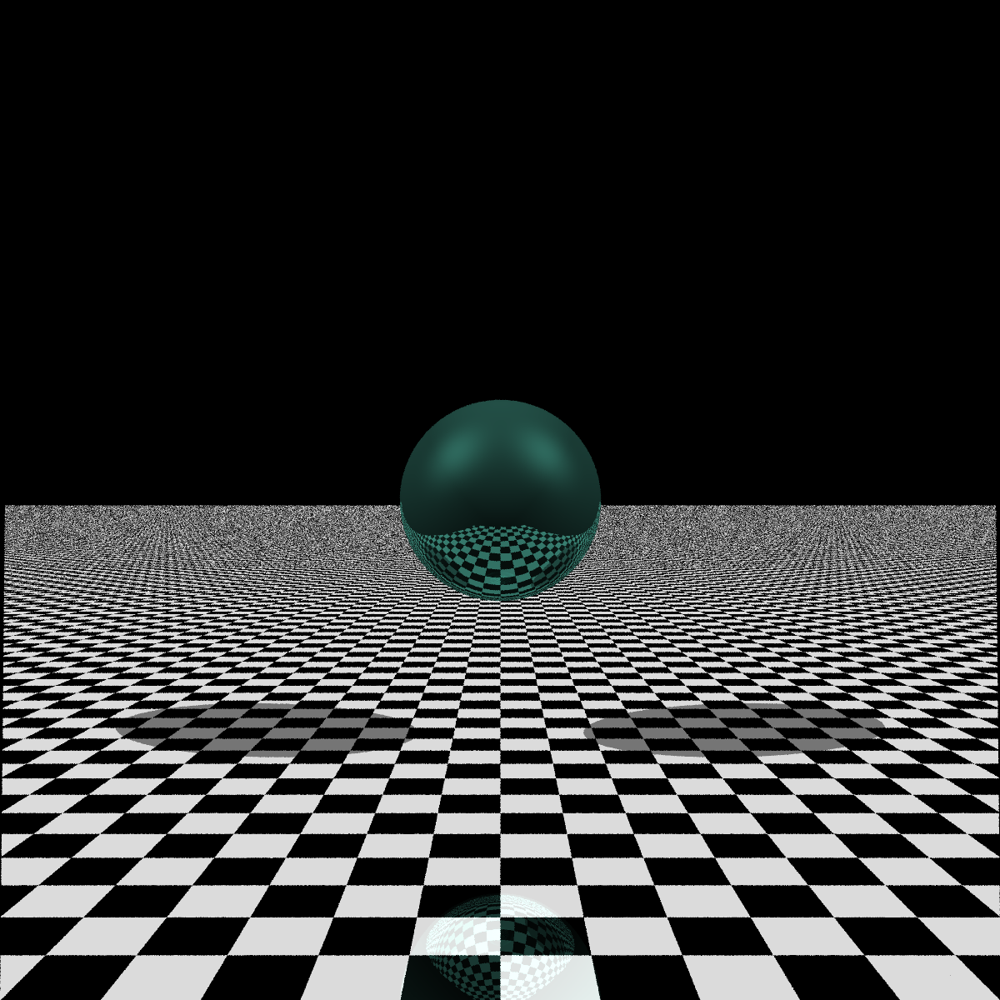
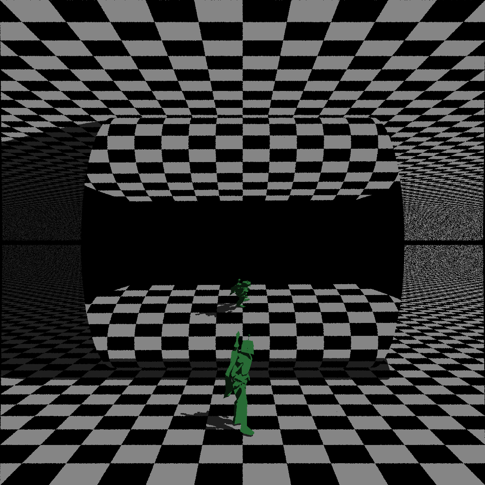
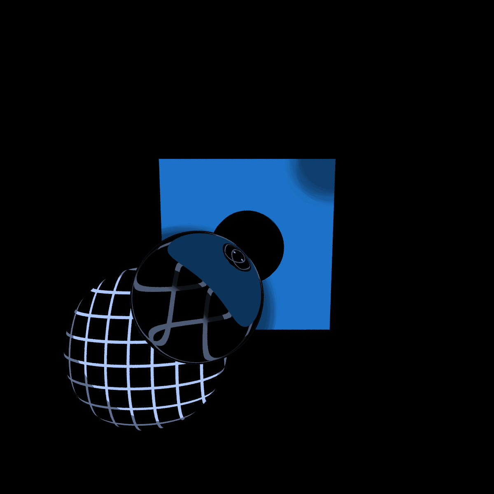

# Ray
 A simple raytracer. YAML goes in, PNG comes out.

# Example Output




## Implemented features
- Object types: spheres, triangle mesh
- Shadows
- Reflections (recursive)
- Refractions (recursive)
- Input format: (from file, yaml)
- Output format: (to file, png)
- Multithreaded rendering


## To Build
The 3rdparty dependency, libyaml-cpp, must be built seperately. Navigate to
the 3rdparty directory and run the build script. It was tested to build
correctly on the lab computers. Hopefully it just works for you. If not, the
most likely cause of failure is missing boost headers. If so, installing boost
should fix the problem.

With the 3rdparty libraries built, make will build the main software.

```
cd 3rdparty;
./build.sh
cd ..
make
```

## To Run
The 'run' script is used to setup the environment for the main program.
e.g.
./run ./ray [options]

For a list of options, use "--help".

Most of the program's function is controlled through the input scene file. The
scene is specified in the YAML data format, and the format should be easy to
pick up from an example, but a specification is available from "--help scene".
